# 🔐 Awesome Public Key Infrastructure (PKI) Platform

<p align="center">
  <a href="https://github.com/ishandutta2007/Awesome-Awesome-Awesome"></a>
  <a href="https://discord.gg/jc4xtF58Ve"></a>
  <a href="https://github.com/ishandutta2007/Awesome-Public-Key-Infrastructure-Platform/stargazers"></a>
  <a href="https://github.com/ishandutta2007/Awesome-Public-Key-Infrastructure-Platform/network/members"></a>
  <a href="https://github.com/ishandutta2007"></a>
</p>

<p align="center">
  
</p>

---

## 🌟 Overview & Market Ecosystem

Welcome to the **Curated Public Key Infrastructure (PKI) & Machine Identity Management Ecosystem Directory**! 

This repository tracks top-tier **SaaS / Enterprise Hosted PKI Platforms** and leading **Open-Source GitHub Projects**. PKI forms the core security foundation of digital trust—issuing, renewing, revoking, and governing X.509 digital certificates across servers, DevOps workloads, cloud instances, microservices, mobile clients, and IoT devices.

### 🎯 Key Focus Areas
- 🔑 **Certificate Authorities (CA)**: Root CAs, Sub CAs, Private CAs, and Public CAs.
- ⚡ **Certificate Lifecycle Management (CLM)**: Discovery, monitoring, policy enforcement, auto-renewal, and ACME/SCEP/EST protocol automation.
- 🤖 **Machine Identity Security**: Microservices, Kubernetes workloads (SPIFFE/SPIRE), service meshes, and zero-trust identity architectures.
- 🛡️ **Post-Quantum Cryptography (PQC)**: Migration tools for quantum-safe digital signatures and certificate algorithms.

---

## 📚 Table of Contents

- [☁️ SaaS / Hosted Enterprise Platforms](#-saas--hosted-enterprise-platforms)
- [⚡ Open-Source GitHub Projects](#-open-source-github-projects)
- [🛠️ Architecture & Deployment Patterns](#%EF%B8%8F-architecture--deployment-patterns)
- [🤝 How to Contribute](#-how-to-contribute)
- [📈 Star History](#-star-history)
- [⚠️ Disclaimer](#%EF%B8%8F-disclaimer)

---

## ☁️ SaaS / Hosted Enterprise Platforms

> 📊 **Market Size & Structure**: The global **Public Key Infrastructure (PKI) & Certificate Lifecycle Management (CLM)** market is estimated at **$5.2 Billion – $6.5 Billion (2025/2026)** and is projected to reach **$14.2 Billion by 2030** (growing at an ~18.5% CAGR). Driven by shorter TLS certificate validity lifespans (dropping from 90 days to 47 days), the sector is **moderately fragmented and rapidly consolidating**. Market leadership is shared between tech giants, dedicated enterprise CLM providers, and traditional Certificate Authorities.

The table below lists top enterprise PKI and CLM SaaS offerings, **sorted by Company Size (Revenue / Valuation / Market Cap) in descending order**:

| Product 🏢 | Company Size (Valuation / Revenue) 💰 | Description 📝 | Pricing 💵 | Free Tier / Free Trial Limits 🎁 |
| :--- | :--- | :--- | :--- | :--- |
| **[Microsoft AD CS & Cloud PKI](https://learn.microsoft.com/en-us/windows-server/identity/ad-cs/)** | **~$3.1 Trillion** Market Cap (~$245B Revenue) | Microsoft’s enterprise CA integrated with Active Directory and Intune Cloud PKI service for automated device identity issuance. | Included in Windows Server ($501 Essentials / $1,069 Standard); Cloud PKI add-on at $2.00/user/mo (included in M365 E5) | 180-day free trial (Windows Server Eval) / 30-day Intune trial for Cloud PKI |
| **[Venafi (CyberArk)](https://www.venafi.com/)** | **~$15 Billion** Market Cap ($1.54B Acquisition) | Enterprise machine identity management platform for multi-cloud certificate discovery, policy enforcement, and workload security. | Enterprise starting tiers at ~$1,500–$5,000/mo (~$18,000+/yr benchmark based on deployment volume) | 30-day free trial (Venafi TLS Protect Cloud / CyberArk Certificate Manager SaaS) |
| **[DigiCert](https://www.digicert.com/)** | **~$3.5 Billion** Valuation (~$650M Revenue) | Leading public CA and private PKI platform featuring Trust Lifecycle Manager for automated enterprise digital trust. | Direct OV TLS certs starting at $24–$26/mo ($288/yr); reseller starting tiers from ~$12.50/mo ($150/yr) | No free-forever plan (30-day money-back guarantee & Test Drive account for PKI testing) |
| **[Entrust PKI](https://www.entrust.com/)** | **~$2.0 Billion+** Valuation (~$800M Revenue) | High-assurance enterprise PKI and certificate lifecycle management solutions for identities, devices, and digital signing. | Managed PKI starting at ~$4,000/yr (test/small envs) up to ~$50,000+/yr for large enterprise deployments | 60-day free trial (Managed PKI 60-day evaluation) |
| **[Keyfactor / EJBCA Enterprise](https://www.keyfactor.com/)** | **~$1.3 Billion** Valuation (~$120M Revenue) | Certificate lifecycle automation platform pairing Keyfactor Command with EJBCA Enterprise CA engine (SaaS & self-hosted). | Est. starting at ~£40,250/yr (~$52,000/yr benchmark via G-Cloud listing; enterprise tiers ~$2,000–$10,000/mo) | 30-day free trial ("Test Drive" on AWS/Azure Marketplace) |
| **[GlobalSign](https://www.globalsign.com/)** | **~$2.0 Billion** Group Cap (~$100M Revenue) | Trusted public CA and enterprise Managed PKI platform providing high-volume digital certificates and identity solutions. | AlphaSSL starting at $12–$49/yr; direct DomainSSL starting at $99–$249/yr | No free-forever plan (7 to 30-day money-back guarantee depending on reseller/product) |
| **[Sectigo](https://www.sectigo.com/)** | **~$280 Million** Revenue (PE Backed) | Comprehensive public & private PKI services with Sectigo Certificate Manager (SCM) for automated discovery and renewal. | DV SSL starting at $96–$99/yr direct (~$12/yr via reseller); Sectigo Certificate Manager starting at ~$2,500/yr | 30-day free trial (Sectigo Certificate Manager 30-day evaluation trial) |
| **[AppViewX](https://www.appviewx.com/)** | **~$50 Million** Revenue (PE Backed) | Certificate lifecycle orchestration and PKI automation platform focused on visibility, governance, and multi-CA management. | Enterprise starting tiers at ~$1,000–$3,000/mo (~$12,000+/yr base tier) | 30-day free trial (extendable up to 90 days upon request) |
| **[KeyTalk](https://www.keytalk.com/)** | **~$10 Million** Revenue (Private) | Automated certificate management and short-lived credential distribution solution for user, server, and device identities. | Enterprise starting tier benchmark at ~€10,000/yr (~$11,000/yr for ~1,000 users base deployment) | Custom evaluation / trial license available upon request for Proof of Concept (PoC) |

---

## ⚡ Open-Source GitHub Projects

The open-source PKI ecosystem is exceptionally mature and powers critical internet infrastructure. The list below contains top open-source Certificate Authorities, ACME clients, and certificate controllers, **sorted by GitHub Star Count in descending order**:

1. **[hashicorp/vault](https://github.com/hashicorp/vault)** [](https://github.com/hashicorp/vault/stargazers)  
   *Secrets management platform whose built-in PKI engine dynamically issues short-lived X.509 certificates programmatically via API.*

2. **[certbot/certbot](https://github.com/certbot/certbot)** [](https://github.com/certbot/certbot/stargazers)  
   *EFF’s automated ACME client that automatically requests, verifies, and installs Let's Encrypt TLS certificates on web servers.*

3. **[acmesh-official/acme.sh](https://github.com/acmesh-official/acme.sh)** [](https://github.com/acmesh-official/acme.sh/stargazers)  
   *Pure Shell script ACME protocol client supporting Let's Encrypt, ZeroSSL, and custom CAs with zero external dependencies.*

4. **[cert-manager/cert-manager](https://github.com/cert-manager/cert-manager)** [](https://github.com/cert-manager/cert-manager/stargazers)  
   *Cloud-native Kubernetes certificate management controller that automates issuance and renewal from ACME, Vault, and internal CAs.*

5. **[go-acme/lego](https://github.com/go-acme/lego)** [](https://github.com/go-acme/lego/stargazers)  
   *Let's Encrypt / ACME client library and CLI written in Go with built-in support for dozens of DNS providers.*

6. **[cloudflare/cfssl](https://github.com/cloudflare/cfssl)** [](https://github.com/cloudflare/cfssl/stargazers)  
   *Cloudflare’s PKI and TLS toolkit for signing, bundling, and inspecting TLS certificates and building custom Certificate Authorities.*

7. **[smallstep/certificates](https://github.com/smallstep/certificates)** (step-ca) [](https://github.com/smallstep/certificates/stargazers)  
   *Modern, lightweight open-source online CA focused on automated short-lived certificates, ACME, SSH credentials, and internal PKI.*

8. **[letsencrypt/boulder](https://github.com/letsencrypt/boulder)** [](https://github.com/letsencrypt/boulder/stargazers)  
   *An ACME-based Certificate Authority implementation in Go, powering Let's Encrypt in production environments.*

9. **[OpenVPN/easy-rsa](https://github.com/OpenVPN/easy-rsa)** [](https://github.com/OpenVPN/easy-rsa/stargazers)  
   *Small script-based tool to manage local Certificate Authority operations, sign certificates, and generate CRLs using OpenSSL.*

10. **[Keyfactor/ejbca-ce](https://github.com/Keyfactor/ejbca-ce)** (EJBCA Community) [](https://github.com/Keyfactor/ejbca-ce/stargazers)  
    *The leading open-source enterprise CA supporting complex hierarchies, SCEP, CMP, EST, ACME, and high-assurance cryptographic protocols.*

11. **[openxpki/openxpki](https://github.com/openxpki/openxpki)** [](https://github.com/openxpki/openxpki/stargazers)  
    *Enterprise open-source trustcenter/PKI framework with a workflow engine, multi-CA support, SCEP/EST protocols, and web UI.*

12. **[dogtagpki/pki](https://github.com/dogtagpki/pki)** [](https://github.com/dogtagpki/pki/stargazers)  
    *Red Hat FreeIPA’s enterprise-class open-source CA supporting full certificate lifecycle, OCSP, KRA, and smart card management.*

---

## 🛠️ Architecture & Deployment Patterns

A modern **Production PKI Architecture** typically combines open-source foundation engines with automated lifecycle controllers:

```
                  ┌─────────────────────────────────────┐
                  │       Root Certificate Authority    │
                  │  (Offline Root CA / Hardware HSM)   │
                  └──────────────────┬──────────────────┘
                                     │
                  ┌──────────────────┴──────────────────┐
                  │    Intermediate Issuing CA Engine   │
                  │ (EJBCA / step-ca / Vault / OpenXPKI)│
                  └──────────────────┬──────────────────┘
                                     │ (ACME / SCEP / EST / REST API)
          ┌──────────────────────────┼──────────────────────────┐
          ▼                          ▼                          ▼
┌───────────────────┐      ┌───────────────────┐      ┌───────────────────┐
│ Kubernetes Clusters│      │ Cloud & Server VMs│      │ IoT & Devices     │
│ (cert-manager)    │      │ (certbot / lego)  │      │ (SCEP / EST)      │
└───────────────────┘      └───────────────────┘      └───────────────────┘
```

---

## 🤝 How to Contribute

Contributions are welcome! Please follow these steps to add or update PKI projects:

1. Fork this repository.
2. Edit `README.md` keeping formatting consistent.
3. For **SaaS tools**: Include name, website, description, specific pricing starting tier, company size estimate, and free trial limits.
4. For **Open-Source projects**: Include repo link, social Stars_Badge linking to `/stargazers`, concise 1-2 sentence description, and ensure proper placement according to star count.
5. Submit a Pull Request describing your changes.

---

## 📈 Star History

[](https://star-history.dera.page/#ishandutta2007/Awesome-Public-Key-Infrastructure-Platform&type=date&legend=top-left)

---

## ⚠️ Disclaimer

- This list is **community-curated** for educational and architectural reference.
- Digital certificates underpin critical internet encryption, authentication, and compliance. Operating a production PKI requires proper HSM key protection, strict operational controls, and clear Certificate Policies (CP/CPS).

---

<p align="center">
  <b>Made for Security Engineers, Platform Teams &amp; Infrastructure Architects</b><br>
  <i>Keeping PKI automated, transparent, and secure.</i>
</p>
